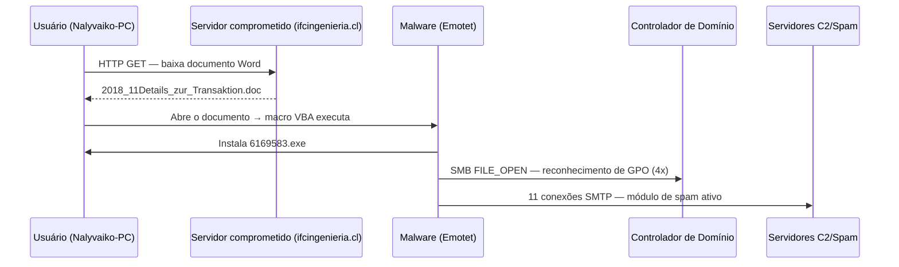

# Visão Geral do Caso

## O cenário

A **Good Money Financial** é uma empresa fictícia do setor financeiro utilizada como contexto didático neste estudo de caso. O incidente parte de uma premissa realista: um colaborador recebe um documento Word aparentemente legítimo, abre o arquivo, e a partir desse único clique uma cadeia de eventos compromete a estação de trabalho, ativa um módulo de spam e expõe a infraestrutura de Active Directory da empresa.

Esse tipo de incidente — chamado de **infecção por macro maliciosa** — foi responsável por milhares de comprometimentos corporativos entre 2017 e 2020, período de maior atividade do Emotet.

---

## Como o caso se divide

### Parte 1 — Tratamento de Incidentes (Zeek)

A equipe de segurança da Good Money Financial capturou o tráfego de rede durante o incidente. Esse tráfego foi preservado em um arquivo PCAP, que é a evidência principal da Parte 1.

Seu papel aqui é o de **Analista de CTI**: você precisa processar o PCAP com o Zeek, extrair os indicadores de comprometimento e produzir um relatório técnico que permita à equipe conter e remediar a ameaça.

### Parte 2 — Análise Forense (Autopsy)

Com base nos dados da Parte 1, a empresa reportou o incidente à **Delegacia de Crimes Cibernéticos (DCC)**. A delegacia identificou o suspeito — **Greg Schardt** — por meio do IP e porta utilizados durante o ataque, obtidos junto à operadora de internet.

Uma operação de busca e apreensão foi realizada na residência do suspeito. O notebook encontrado foi apreendido e uma imagem forense do disco foi gerada com hash MD5 para garantir a integridade da evidência.

Seu papel aqui é o de **Perito Forense**: você precisa analisar a imagem do disco com o Autopsy e produzir um Laudo Pericial correlacionando as evidências ao suspeito.

---

## Por que esse caso é representativo

!!! tip "Relevância para a prática"
    Os dois conjuntos de evidências utilizados neste estudo de caso são **dados públicos reais**:

    - O PCAP da Parte 1 é proveniente do arquivo **malware-traffic-analysis.net (CTF 2018)** — uma infecção real por Emotet documentada publicamente.
    - A imagem de disco da Parte 2 é o dataset **NIST CFREDS** (*Computer Forensics Reference Data Sets*) — mantido pelo Instituto Nacional de Padrões e Tecnologia dos EUA para fins de treinamento forense.

    Trabalhar com evidências reais — mesmo que em contexto didático — é fundamentalmente diferente de trabalhar com dados sintéticos. Os artefatos são imperfeitos, os timestamps têm ambiguidades, e as conclusões exigem raciocínio, não apenas execução de comandos.

---

## Fluxo da investigação

