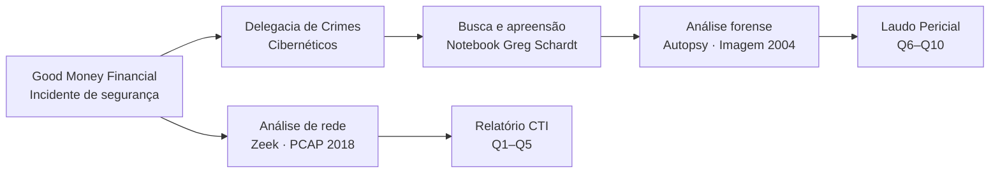

# THDB — Relatório de Incidente Forense

!!! info "Sobre este material"
    Este projeto documenta um estudo de caso completo de **resposta a incidente e forense digital**, conduzido em ambiente de laboratório controlado. O objetivo é servir como referência prática para estudantes que estão iniciando nas áreas de CTI (*Cyber Threat Intelligence*) e análise forense.

---

## O que você vai aprender

=== "Parte 1 — Zeek"
    - Processar um arquivo PCAP com o Zeek e extrair logs estruturados
    - Identificar o host comprometido via `dhcp.log`
    - Rastrear o vetor de entrada via `http.log` e `files.log`
    - Analisar comportamento de malware (spam, reconhecimento de AD)
    - Produzir um Relatório CTI com IoCs, MITRE ATT&CK e Kill Chain

=== "Parte 2 — Autopsy"
    - Verificar a integridade de uma imagem forense via hash MD5
    - Extrair artefatos do Windows (registro, histórico, programas)
    - Identificar ferramentas ofensivas e evidências de uso
    - Construir uma timeline de eventos
    - Produzir um Laudo Pericial formal

---

## Estrutura do caso

---

## Casos analisados

| | Caso 1 — Emotet | Caso 2 — Greg Schardt |
|---|---|---|
| **Ferramenta** | Zeek 6.0.4 | Autopsy 4.21.0 |
| **Evidência** | PCAP · malware-traffic-analysis.net | Imagem de disco · NIST CFREDS |
| **Período** | Novembro de 2018 | 2004 |
| **VM** | `forenseLinux` · 192.168.98.10 | `forenseWin` · 192.168.98.30 |
| **Entregável** | Relatório CTI | Laudo Pericial |

!!! warning "Independência dos casos"
    Os dois cenários são **cronológica e factualmente independentes** — não há relação direta entre a rede `kyivartworks.com` (2018) e o suspeito Greg Schardt (2004). Ambos são utilizados para fins didáticos dentro do mesmo módulo.

---

## Como usar este material

**Se você está começando:** leia o [Contexto do Caso](contexto/visao-geral.md) antes de qualquer coisa. Entender *o que* aconteceu é fundamental antes de aprender *como* detectamos.

**Se você quer reproduzir o lab:** vá direto para [Configuração do Ambiente](ambiente/configuracao.md).

**Se você quer só consultar comandos:** cada questão (Q1–Q10) tem sua própria página com o comando, a saída esperada e a interpretação.
