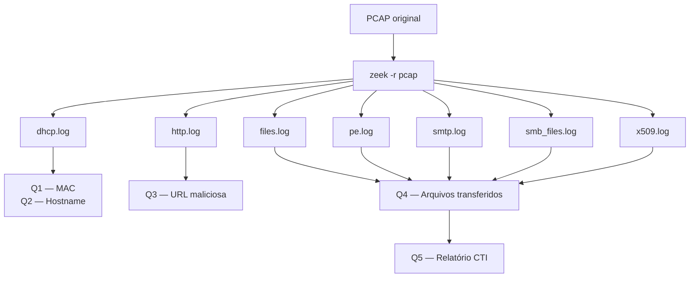

# Parte 1 — Análise de Rede com Zeek

## O que é o Zeek?

O **Zeek** (anteriormente chamado de Bro) é um framework open-source de análise de tráfego de rede. Diferente de um IDS tradicional que apenas alerta sobre padrões conhecidos, o Zeek **transcreve o tráfego de rede em logs estruturados** — cada protocolo (HTTP, DNS, SMTP, SMB etc.) gera seu próprio arquivo de log com campos bem definidos.

Isso torna o Zeek especialmente poderoso para análise forense: em vez de analisar pacotes brutos, você trabalha com dados já interpretados e indexáveis.

---

## O que é o zeek-cut?

O `zeek-cut` é uma ferramenta auxiliar que extrai colunas específicas dos logs do Zeek. Os logs usam `#fields` para declarar o cabeçalho e são separados por tabulação — o `zeek-cut` funciona como um `cut` especializado para esse formato.

```bash
# Sintaxe básica
zeek-cut campo1 campo2 < arquivo.log

# Exemplo: extrair apenas IP e hostname do dhcp.log
/opt/zeek/bin/zeek-cut client_addr host_name < dhcp.log
```

---

## Fluxo de trabalho adotado



---

## Questões respondidas nesta parte

| Questão | O que responde | Log principal |
|---|---|---|
| [Q1](q1-mac.md) | Endereço MAC do host comprometido | `dhcp.log` |
| [Q2](q2-hostname.md) | Hostname do host comprometido | `dhcp.log` |
| [Q3](q3-url.md) | URL que entregou o documento Word | `http.log` |
| [Q4](q4-infeccao.md) | Tipo de infecção identificada | múltiplos |
| [Q5](q5-relatorio-cti.md) | Relatório CTI completo | — |
